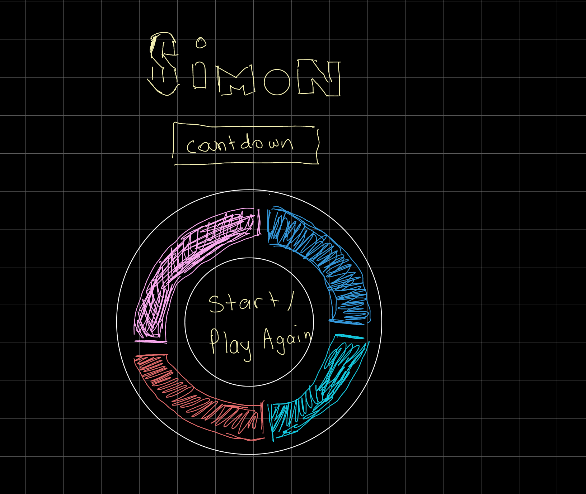

    

# 🕹️ Simon

## Description

Simon is a short-term memory game where the player must repeat an increasing sequence of lights and sounds. The game begins with Simon playing his sequence, and the player mimics the sequence in order to make it to the next round. Each round Simon adds another step to the sequence making it harder to remember. The game ends when a player enters an incorrect sequence.

## 📸 Screenshots

|      Screenshot       |                      Description                      |
| :-------------------: | :---------------------------------------------------: |
| **Simon's Sequence**  |  |
| **Player's Sequence** |        |
|    **Next Round**     |         |

## 💻 Technologies Used

  

## 🧩 Getting Started

Click to play [Simon!][link]

[link]: https://danag314.github.io/simon-game/

🎮 Game Instructions

1. Press the `START` button.
2. Simon will play his sequence.
3. Choose the same pattern as Simon by clicking on the correct pads.
4. If your sequence matches Simon's sequence `NEXT ROUND` starts, the process will repeat but with another color added this time.
5. If incorrect press the `RESET` button to reset the game, and then press `START` to play again.

📋 Planning

- One player game
- Player clicks `START` button triggers the countdown to start the game
- Simon starts its random 4 index pattern, pads light up with delay in between so that player is able to better remember pattern. Pads also have their own sound.
- Once Simon is done its pattern, its the players turn to click the correct pattern. If player pattern is equal to Simons pattern, the next round starts to play.
- If player enters one incorrect pad pattern it is `GAME OVER`.
- When player enters next round, Simon plays the same pattern as the last but adds another pad to the pattern at the end.
- When it is `GAME OVER` there is a `RESET` button that will reset the game and player can click `START` again to start a new game.

## 🚶🏻‍➡️ Next Steps

- Add a `GAME OVER` sound that plays, and show text as red.
- Make the `RESET` button animated.
- Add a `Best Score` feature.
